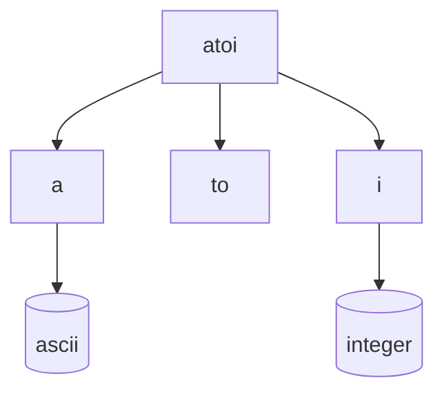

# atoi()

> atoi() is a built in funtion i C sits inside the `stdlib.h` header file.


atoi() is used to convert a string to an integer. It takes a string as input and returns the corresponding integer value. If the string does not contain a valid integer, it returns 0.

## Syntax

```c
int atoi(const char *str);
```

### example

```c
#include <stdio.h>
#include <stdlib.h>

int main() {
    const char *str = "12345";
    int num = atoi(str);
    printf("The integer value is: %d\n", num);
    // output is integer value is: 12345
    return 0;
}
``` 